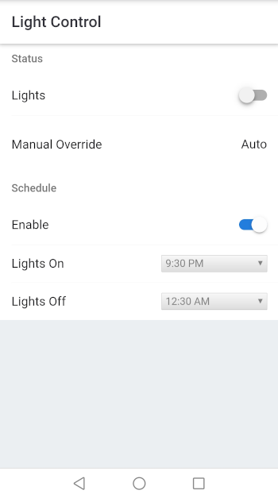

lightctl
========

``lightctl`` is a light control system for my 12 V outdoor lights,
running on the esp32, written for the [esp-idf](https://github.com/espressif/esp-idf)
framework. It serves a practical purpose, and enables me to build something
just for the hell of it, out of stuff I had laying around.

``lightctl`` allows for turning the lights on by pressing a button in
the UI, or by scheduling 'on' and 'off' times. There's a manual
override switch, just in case.

This was done on an ESP32-WROOM on a "DevKitV1" board with 4 MB of flash
storage.

Usage
-----

Use ``idf.py menuconfig`` and ensure that all the options for lightctl
(``Component Config -> Light Control``) are set according to your needs.

Then, hook up your board and ``idf.py flash`` and you should be good to
go. There's a small web app running on the builtin http server which
allows you to toggle the lights on and off, and set a schedule.

The status led will blink while the esp32 is connecting to the WiFi. Once
connected, the led will stay solid.

Override
--------

The override switch pins allow for switching the lights on and off
manually. In the "On" position IO34 will go high (IO35 will be pulled low),
and the lights will be turned on; regardless of what's selected in the UI.

In the "Off" position, IO35 will go high (IO34 will be pulled low), and
the lights will be kept off.

Limitations
-----------

I designed this circuit to accomodate a maximum current of up to 500 mA
for the lights. If you need more current, you'll have to replace the
transitor and base resistor with a configuration appropriate for your
needs.

Schematic
---------

